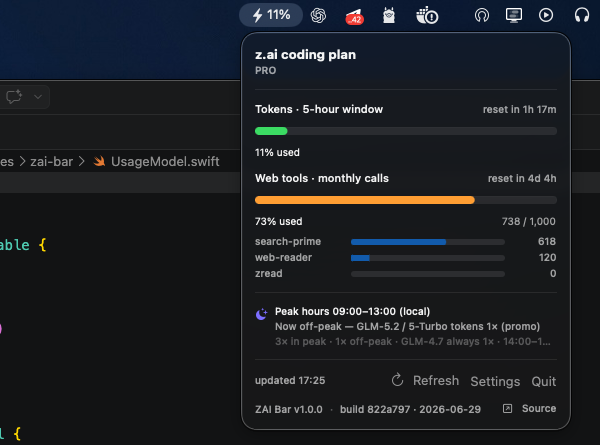

# zai-bar

[](https://github.com/ruhex/zai-bar/releases)
[](./LICENSE)
[](https://www.apple.com/macos/)
[](https://www.swift.org/)

A macOS menu-bar widget that shows your **z.ai / GLM Coding Plan** quota at a
glance — the 5-hour token-window percentage lives in your menu bar so you
always know how much you have left before the window resets.



## What it is

**zai-bar** is a tiny, native macOS menu-bar agent for the
[z.ai](https://z.ai) GLM Coding Plan. It logs the plan's `quota/limit` numbers
— model tokens (5-hour window, weekly) and web-tool calls (monthly) — and
surfaces the most actionable one (the 5-hour token window %) right in the menu
bar, with a richer popover for the rest.

It is a real macOS app, not a browser extension:

- No Dock icon, no app switcher entry — only a menu-bar item (`MenuBarExtra` +
  `LSUIElement`).
- No proxy, no Electron — direct native `URLSession` calls to `api.z.ai`.
- Your API key never leaves the machine: it lives in the **macOS Keychain**.

## Requirements

- macOS **14.0 (Sonoma)** or newer.
- To build from source: **Swift 5.9+**. The free Xcode Command Line Tools are
  enough — install them with `xcode-select --install`.
- A **z.ai GLM Coding Plan** subscription and its coding-plan API key.

## Install

> **About signing.** zai-bar is **not notarized** (the author has no Apple
> Developer ID), so a *downloaded* binary trips Gatekeeper on first launch.
> The smoothest path is to **build it yourself**: a binary you compile on your
> own Mac is never quarantined and opens with no warnings at all.

### Option 1 — Build from source (recommended)

```bash
xcode-select --install          # only if you don't already have Swift
git clone https://github.com/ruhex/zai-bar.git
cd zai-bar
swift run                       # builds and runs — ⚡ appears in your menu bar
```

That's it. Click the ⚡ icon, paste your z.ai API key, done.

Prefer a double-clickable **ZAIBar.app** instead of `swift run`?

```bash
./release.sh                    # builds a universal ZAIBar.app (+ zip) in .build/
open .build/ZAIBar.app
```

Then [make it permanent & autostart at login](#make-it-permanent--autostart-at-login).

#### Building for a specific architecture

`swift build` targets your Mac's **native** architecture by default. Pick the
command that matches what you want:

| Goal | Command | Output binary |
|---|---|---|
| Just run it (native arch) | `swift run` | — |
| Release build, native arch | `swift build -c release` | `.build/release/zai-bar` |
| **Universal** (Apple Silicon + Intel) | `swift build -c release --arch arm64 --arch x86_64` | `.build/apple/Products/Release/zai-bar` |

> The universal binary lives at **`.build/apple/Products/Release/zai-bar`** —
> *not* `.build/release/zai-bar`, which is single-arch (your Mac's native arch
> only). `release.sh` uses the universal path and is the easiest way to get a
> shareable `.app`.

- **Apple Silicon (M-series):** plain `swift run` / `swift build` is all you
  need for personal use — it produces an arm64 binary.
- **Intel Mac:** same — `swift build` produces an x86_64 binary.
- **Share with the other architecture:** build universal with
  `--arch arm64 --arch x86_64` (or just run `./release.sh`), which works on both.

### Option 2 — Download a release binary

1. Go to the [Releases page](https://github.com/ruhex/zai-bar/releases) and
   download `zai-bar-<version>-universal-macos.zip`.
2. Unzip it and drag **ZAIBar.app** to `/Applications`.
3. Because the build is adhoc-signed (not notarized), the first launch is
   blocked by Gatekeeper. Bypass it **once**, either:
   - **GUI:** right-click **ZAIBar.app** → **Open** → **Open anyway**, or
   - **Terminal:** `xattr -dr com.apple.quarantine /Applications/ZAIBar.app`

### Option 3 — Homebrew Cask (planned)

> **(planned)** — the cask is not live yet. Once the tap exists:

```bash
brew install --cask ruhex/tap/zai-bar
```

Until then, use Option 1 or Option 2.

### Make it permanent & autostart at login

After building (or downloading), the app lives at `.build/ZAIBar.app` (or the
unzipped location). To make it a permanent, Spotlight/Launchpad-findable app,
move it into `/Applications` and launch it:

```bash
mv .build/ZAIBar.app /Applications/ZAIBar.app
open /Applications/ZAIBar.app          # ⚡ appears in your menu bar
```

> Use `~/Applications` instead of `/Applications` for a per-user install (no
> admin rights needed).

Because the app is `LSUIElement`, it lives **only in the menu bar** (no Dock
icon) — that's how you tell it's running. Quit it from the popover's **Quit**
button.

**Start automatically at login** — pick one:

- **System Settings (recommended):** open **System Settings → General →
  Login Items & Extensions**, click **+** under "Open at Login", and choose
  `/Applications/ZAIBar.app`.
- **Terminal one-liner:**
  ```bash
  osascript -e 'tell application "System Events" to make login item at end with properties {path:"/Applications/ZAIBar.app", hidden:true}'
  ```
  (The first time you may be prompted to grant your terminal **Accessibility**
  permission under System Settings → Privacy & Security.)

To remove autostart later: delete it from the same Login Items list, or
`osascript -e 'tell application "System Events" to delete login item "ZAIBar"'`.

## First run

1. Launch `ZAIBar.app`. A **⚡** icon appears in your menu bar.
2. Click the **⚡** icon.
3. Paste your **z.ai API key** (format `id.secret` — the *same* key you use for
   `chat/completions`) and click **Save & connect**.

The key is stored in the macOS Keychain and the popover fills with your current
quota. To change or remove it later, click **Settings** → **Remove key**.

## How it works

zai-bar calls two monitor endpoints:

```
GET https://api.z.ai/api/monitor/usage/quota/limit
GET https://api.z.ai/api/monitor/usage/model-usage?startTime=...&endTime=...  # last 24h, "yyyy-MM-dd HH:mm:ss"
Authorization: Bearer <your coding-plan API key>
Accept: application/json
```

- **Auth:** a plain Bearer token using your coding-plan API key — *no* JWT,
  *no* separate session cookie.
- **Native:** straight from your Mac to `api.z.ai` over `URLSession`. No proxy.
- **Cadence:** auto-refresh every **5 minutes**, plus an on-demand **Refresh**
  button. The reset countdown updates live.

### Reading the data

The response lives under `data.limits[]`, keyed by a `(type, unit)` window code:

| `type`          | `unit` | meaning                          |
|-----------------|--------|----------------------------------|
| `TOKENS_LIMIT`  | `3`    | Model tokens — **5-hour window** |
| `TOKENS_LIMIT`  | `6`    | Model tokens — **weekly**        |
| `TIME_LIMIT`    | `5`    | Web tools — **monthly** calls    |

Each limit carries `percentage` (0–100), optional `currentValue`/`usage`
(used/total), `nextResetTime` (epoch ms → the countdown), and optional
`usageDetails[]` (per-model breakdown, present for the monthly web-tool limit).

The **menu-bar headline is the 5-hour token-window %** — the resource that
depletes fastest while coding. It falls back to the weekly token window, then
to the highest token percentage.

## Peak hours

The GLM Coding Plan charges advanced models (GLM-5.2 / GLM-5-Turbo) at a higher
quota multiplier during a daily peak window:

- **Peak:** 14:00–18:00 in **UTC+8** (China Standard Time, no DST) → **3×**.
- **Off-peak:** outside the window → normally **2×**.
- **Limited-time promo:** until **2026-10-01**, off-peak is **1×**.
- **GLM-4.7** is **always 1×**.

The popover's peak block converts the peak window to **your local time**, shows
whether you're currently in peak, and the effective advanced-model multiplier.

## Security

- Your API key is a **Keychain generic-password item** (service `zai-bar`,
  account `api-key`) — never written to disk in plaintext, never logged.
- The key is **sent only to `api.z.ai`** over HTTPS.
- **No telemetry, no analytics, no remote logging** — exactly one outbound
  request (the quota endpoint) and nothing else.
- Remove the key anytime via **Settings → Remove key**, or **Keychain Access**.

## Limitations

- **Undocumented endpoints.** The `/api/monitor/*` family is the internal API
  the z.ai dashboard calls — no public contract, no SLA. Stable in practice but
  can change without notice.
- **Coding-plan key only.** This key authorizes the monitor endpoints and the
  coding-plan chat endpoints. Pointing it at the general `/api/paas/v4/...`
  chat endpoint returns error `1113` (no balance) — expected, not a bug.
- **Personal/individual plans only.** Team plans need extra headers that
  zai-bar doesn't send.
- **China region:** uses `https://open.bigmodel.cn` with the same paths — change
  `ZAIClient.host` and rebuild.
- **macOS 14+ only.** Universal (Apple Silicon + Intel), but unsigned unless
  you build it yourself.

## Building & releasing (for maintainers)

`release.sh` is the single build/release script. It builds a **universal**
binary, signs it (Developer ID + notarization if credentials are present,
otherwise adhoc), zips it with `ditto`, and can publish a GitHub Release:

```bash
./release.sh            # build + sign + zip; prints the gh release command
./release.sh --publish  # also tags vX.Y.Z and creates the GitHub Release
```

To **notarize** (so the binary opens silently for everyone), you need an Apple
Developer ID ($99/yr). Export these before running, and `release.sh` switches
to the signed + notarized + stapled path automatically:

```bash
export APPLE_ID="you@example.com"
export APPLE_APP_SPECIFIC_PASSWORD="xxxx-xxxx-xxxx-xxxx"
export APPLE_TEAM_ID="ABCDEFGHIJ"
./release.sh --publish
```

Without those, the release is adhoc-signed and triggers Gatekeeper on other
Macs (see [Option 2](#option-2--download-a-release-binary)).

Automated releases on every tag are wired in `.github/workflows/release.yml`
(it ships in manual `workflow_dispatch` mode — uncomment the `push: tags`
trigger to go automatic).

## License

[MIT](./LICENSE) © 2026 Mikhail.

## Disclaimer

**zai-bar** is an independent, community-built tool. It is **not affiliated
with, endorsed by, or sponsored by Z.ai / Zhipu AI.** "z.ai", "GLM", and
related marks are property of their respective owners. It relies on
undocumented z.ai endpoints that may change at any time without notice.

## Acknowledgements

- [z.ai](https://z.ai) / Zhipu AI for the GLM family and the Coding Plan.
- The community of z.ai quota monitors and Z.ai's own `glm-plan-usage` plugin,
  which together reverse-engineered and validated the `/api/monitor/*` contract.
- Apple's `MenuBarExtra` + SwiftUI, which made a tiny menu-bar app possible.
